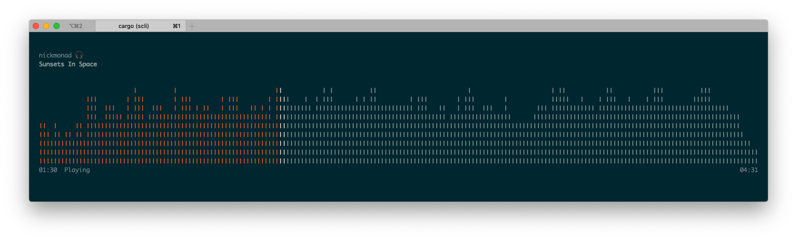

scli
====

Stream SoundCloud... in your terminal!



## How?

`scli` justs needs a SoundCloud URL to start playing a track.

```
$ scli https://soundcloud.com/trippycode/boris-brejcha-art-of-minimal-techno-tripping-the-mad-doctor-by-rttwlr
```

Or, any other you'd like to play! :fire:

**Please note, this interacts with SoundCloud's public API, and therefore does not support subscription content at this time.**

### Controls

```
* Play/Pause: spacebar
* Quit:       q
```
